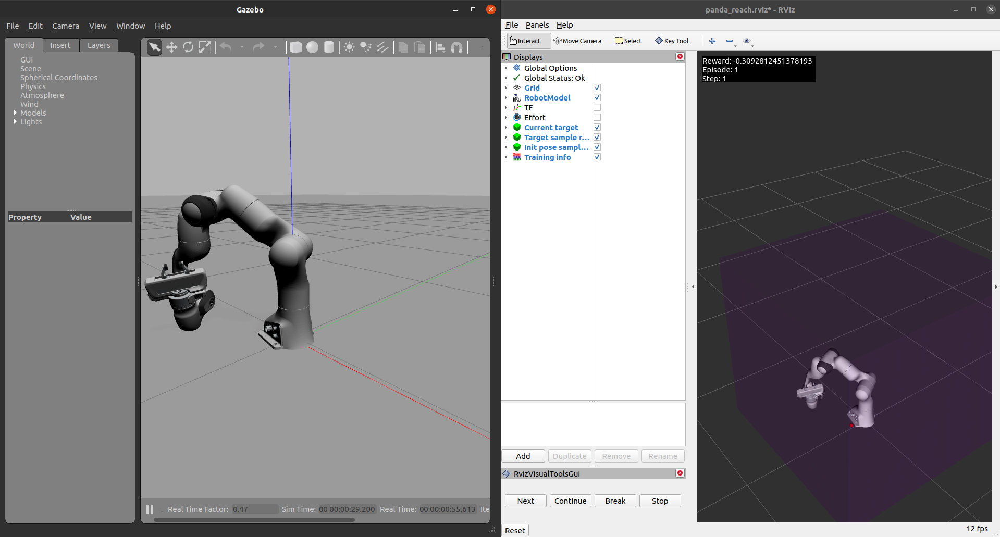

Panda Environment
=================

The Panda robot is a high-performance 7DOF research robot created by `Franka Emika`_. It
is very sensitive, agile and contains torque sensors at each joint, allowing
adjustable stiffness/compliance and advanced torque control.

It is controlled through the `Franka Control Interface`_ (FCI), which can be accessed
via several open-source components provided on `GitHub <https://github.com/frankaemika>`_.
These components contain both a low-level C++ library called `libfranka`_  and a high-level
ROS interface called `franka_ros`_. The high-level interface provides support for both ROS
Control and MoveIt!

.. figure:: img/panda_robot.png
   :alt: Panda Robot

.. _Franka Emika: https://www.franka.de
.. _Franka Control Interface: https://frankaemika.github.io/docs/
.. _libfranka: https://frankaemika.github.io/docs/libfranka.html
.. _franka_ros: https://frankaemika.github.io/docs/franka_ros.html

It also comes with a simulated version (i.e. `franka_gazebo`_) that uses all the SDK systems
that the real robot does, so anything you develop for the simulation should work
seamlessly with the real robot.

.. attention::
   There are some small differences between the real and simulated robot:

      - The masses and inertias are not precisely equal between the simulated and the real robot.
      - The simulation motion generators are not equal to the ones contained in the
        `FCI <https://frankaemika.github.io/docs/libfranka.html#realtime-commands>`_.

.. _franka_gazebo: https://frankaemika.github.io/docs/franka_ros.html#franka-gazebo

Control types
*************

The `openai_ros`_ version of the Panda environment allows for four types of control: ``effort``, ``position``, ``trajectory`` and
``end-effector`` control. End-effector control is implemented through `MoveIt`_.

.. _MoveIt: https://moveit.ros.org/

.. seealso::
   All the components used to create the `openai_ros`_ Panda environment are contained in the `panda-gazebo`_ ROS workspace
   package. This package is automatically downloaded and built by `openai_ros`_ package when running one of the panda task
   environments.

.. _panda-gazebo: https://github.com/rickstaa/panda-gazebo

Task environments
*****************

The tasks environments that are in the panda `openai_ros`_ package were based on the fetch environments that are found in the `openai gym`_
package. It currently contains the following task environments:

- :task_envs_code:`PandaReach-v0 <panda/panda_reach.py>`: Move Panda to a goal position.
- :task_envs_code:`PandaPickAndPlace-v0 <panda/panda_pick_and_place.py>`: Lift a block into the air.
- :task_envs_code:`PandaPush-v0 <panda/panda_push.py>`: Push a block to a goal position.
- :task_envs_code:`PandaSlide-v0 <panda/panda_slide.py>`: Slide a puck to a goal position.

.. _Franka Emika: https://www.franka.de
.. _Franka Control Interface: https://frankaemika.github.io/docs/
.. _libfranka: https://frankaemika.github.io/docs/libfranka.html
.. _franka_ros: https://frankaemika.github.io/docs/franka_ros.html

.. _openai gym: https://gym.openai.com/envs/#robotics
.. _openai_ros: http://wiki.ros.org/openai_ros

Robot Environment
*****************

openai_ros.robot_envs.panda_env module
---------------------------------------

.. automodule:: openai_ros.robot_envs.panda_env
    :members:
    :undoc-members:
    :show-inheritance:

Task Environments
*****************

.. toctree::
   :maxdepth: 4

   openai_ros.task_envs.panda
